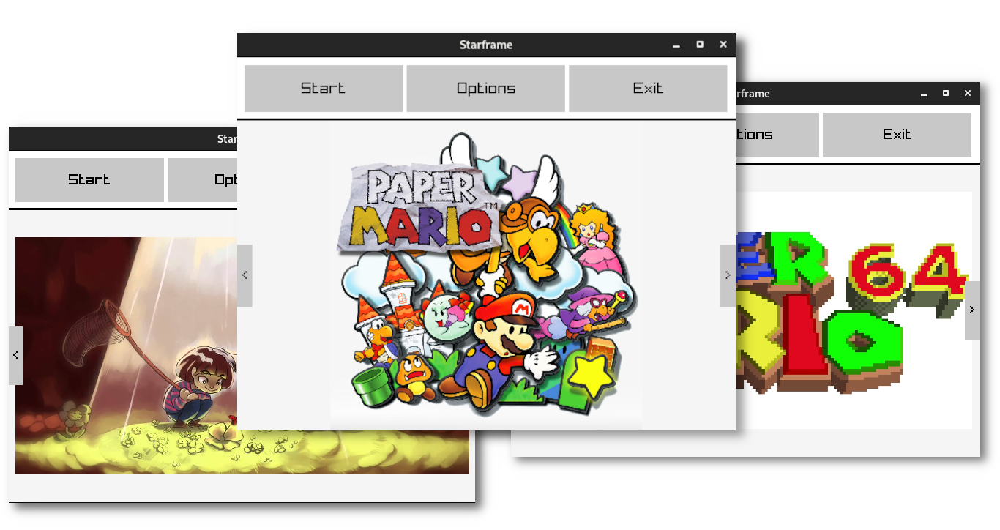

<h1 align=center> Starframe - Game library </h1>
<p align=center> </p>


---
<p align=center>A powerful application to reunite all your games (emulated and native) on a simple customizable UI.</p>

<h4 align=center>🚧 Under Construction 🚧</h4>

## Description

**Starframe** is a powerful game's library application, with objective to bring the power of a gaming station to your computer. Use this with a gamepad and it will turn in a videogame for your computer.

You also can install little scripts to customize your experience with Starframe, some features like running customizable emulators or organize games in folders.

## Features
Currently, **Starframe** is not a finished project, and I only finished the visual and some minimal effects. I still have a lot of thing to do, here some them:

- [ ] A clean and functional UI;
- [ ] Core for plugins using [Rhai Language](https://rhai.rs/);
- [ ] Register of Games on the library;
- [ ] Add other things to this list!

## How to build

### Prerequisites
To build and test Starframe, you need **Cargo** on your system. Until now, I only tested Starframe on Linux, so other OSes maybe not compile.

### How to run
Run the application with:
```bash
$ LD_LIBRARY_PATH=libs cargo run
```

**OBS:** the `libs/` is a folder with [Raylib](https://www.raylib.com/) binaries for Linux, if you need binary for another OS, [download it here](https://github.com/raysan5/raylib/releases/tag/3.5.0).